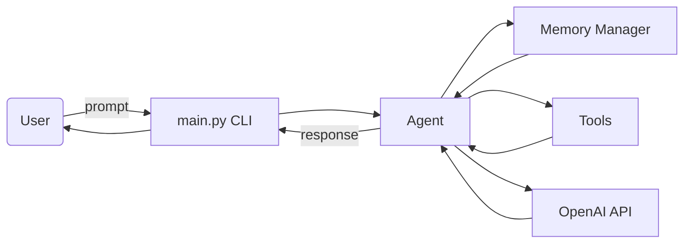

# 🧠 agent_sandbox

**A hands-on, Python-based playground for mastering Agentic AI — from first principles to advanced workflows.**

---

## 🌟 Project Overview

`agent_sandbox` is a production-quality, modular project designed for Python developers to **learn, build, and master Agentic AI systems** using LangChain, OpenAI, and supporting tools. This is not just another chatbot — this is a sandbox where you learn how AI agents **reason, plan, use tools, and reflect** to solve complex tasks step by step.

> 🚀 Whether you're new to Agentic AI or ready to design multi-agent systems, this repo guides you through a complete learning journey.

---

## 🧩 What is Agentic AI?

**Agentic AI** is an approach to building intelligent systems that act autonomously by:
- Observing their environment or user input
- Reasoning over tasks using memory and planning
- Taking **actions** through tools or APIs
- Reflecting and iterating on their responses

Unlike simple LLM prompts, agents can **think, plan, and act** — enabling more robust and flexible AI behavior.

---

## 📁 Folder Structure

```
agent_sandbox/
│
├── agents/                  # Individual agent implementations
│   ├── simple_agent.py
│   ├── react_agent.py
│   ├── reflection_agent.py
│   └── multi_agent.py
│
├── tools/                   # Custom tools and wrappers
│   ├── calculator_tool.py
│   ├── search_tool.py
│   └── code_executor.py
│
├── memory/                  # Memory logic (short-term, buffer, etc.)
│   └── memory_manager.py
│
├── prompts/                 # Prompt templates and examples
│   └── base_prompts.py
│
├── data/                    # Data for testing or vector DB integration
│
├── ui/                      # Optional Streamlit frontend
│   └── app.py
│
├── tests/                   # Example prompts and reproducible flows
│   └── test_queries.py
│
├── utils/                   # Helper functions
│   └── logging_utils.py
│
├── main.py                  # Entry point for the CLI interface
├── requirements.txt
└── README.md
```

---

## 🏗 Architecture Overview

Below is a high-level depiction of how a prompt flows through the project.



The CLI routes your request to the selected agent. That agent can pull context
from memory, invoke tools, and call the OpenAI API before returning a response.

---

## ⚙️ Setup Instructions

### 1. Clone the Repo

```bash
git clone https://github.com/yourusername/agent_sandbox.git
cd agent_sandbox
```

### 2. Set Up Virtual Environment

```bash
python -m venv .venv
source .venv/bin/activate  # or .venv\Scripts\activate on Windows
```

### 3. Install Dependencies

```bash
pip install -r requirements.txt
```

### 4. Add Environment Variables

Create a `.env` file with:

```
OPENAI_API_KEY=your_openai_key
```

The project uses `python-dotenv` so this file will be loaded automatically when
the agent starts.

### 5. Run the CLI

Start an interactive session with one of the available agents:

```bash
python main.py --agent react
```

Valid options for `--agent` are `simple`, `react`, `reflection`, and `multi`.

---

## 🛠️ Core Capabilities Demonstrated

This sandbox guides you through building agents with increasing capability.

| Capability                  | Concepts Introduced                             |
|----------------------------|--------------------------------------------------|
| Tool Usage                 | Calculator, Web Search, Code Runner             |
| Memory Integration         | Short-term memory with context awareness       |
| ReAct Agent                | Reasoning + Acting loop with tool calling       |
| Reflection & Retry Logic   | Evaluate & refine bad outputs                   |
| Multi-Agent Workflows      | Planner, Executor, Critic (optional/advanced)   |

---

## 🧪 Example Queries (Try These!)

Test your agent step-by-step:

- ✅ **Fact Retrieval:**  
  _"What is the capital of France?"_

- 🧮 **Tool Use (Calculator):**  
  _"Calculate 18 * (12 - 3)"_

- 🧠 **World Knowledge:**  
  _"Who invented Python?"_

- 🧑‍💻 **Code Execution:**  
  _"Run this code: total = sum([1, 2, 3]); print(total)"_

- 🧠 **Memory Recall:**  
  _"What did I ask you earlier?"_

---

## 📚 Learning Path: Mastering Agentic AI

### ✅ Step 1: Build a Simple Agent
- Uses OpenAI LLM to respond.
- No tools or memory.
- File: `agents/simple_agent.py`

### ✅ Step 2: Add Tools
- Use LangChain's `Tool` abstraction.
- Add calculator, search, and code executor.
- Wrapper class `ToolAgent` exposes these utilities.
- Files: `tools/*.py`, `agents/tool_agent.py`

### ✅ Step 3: Integrate Memory
- Use `ConversationBufferMemory` or custom memory.
- Track recent queries.
- File: `memory/memory_manager.py`

### ✅ Step 4: Implement ReAct Agent
- ReAct = **Reason + Act + Observe**
- Agent decides tool use based on reasoning steps.
- File: `agents/react_agent.py`

### ✅ Step 5: Add Reflection Logic (Optional)
- Add ability to retry if answer is incomplete or wrong.
- Meta-reasoning with critique prompts.
- File: `agents/reflection_agent.py`

### ✅ Step 6: Multi-Agent System (Advanced)
- Planner → Executor → Critic setup.
- Task decomposition and delegation.
- File: `agents/multi_agent.py`

---

## 💡 Ideas to Expand

- 🧠 **Vector DB Memory:** Add Chroma or FAISS for long-term document recall.
- 🎛 **LangGraph Integration:** Turn your agent into a directed graph with memory and edge logic.
- 🧑‍🎨 **Streamlit UI:** Build an interactive frontend to visualize agent thoughts and tool use.
- 🔍 **Evaluation Module:** Auto-evaluate agent responses using success/failure metrics.
- 💬 **Multi-modal Inputs:** Extend to images, PDFs, or audio with LangChain plugins.

---

## 🧠 Key Concepts You’ll Learn

- Prompt engineering for agents
- Tool chaining and execution
- Agent memory and state handling
- ReAct framework and stepwise planning
- Self-reflection and retry strategies
- Multi-agent coordination logic

---

## 📌 Requirements

- Python 3.9+
- OpenAI API key
- LangChain
- Streamlit (optional)
- `pydantic`, `dotenv`, `tqdm`, `chromadb` (optional)

Install everything via:

```bash
pip install -r requirements.txt
```

---

## 🤝 Contributing

This project is a **learning playground** — contributions are welcome!

- 📄 Improve prompt templates
- 🧪 Add test flows or edge cases
- 🧠 Suggest new tools or agent logic
- 🖼 Build a Streamlit dashboard

---

## 🧭 Final Goal

To **understand how agents think and act — not just chat**. You'll emerge with a deep grasp of:

- Agentic architecture
- Real-world tooling
- Planning + reasoning workflows
- Debugging and tracing complex agent behavior

---

## 📬 Feedback & Support

If you found this useful or want to collaborate, feel free to [open an issue](https://github.com/yourusername/agent_sandbox/issues) or connect via [LinkedIn](https://www.linkedin.com/in/your-profile/).

---

**Happy hacking, agent master! 🧠🛠️**
