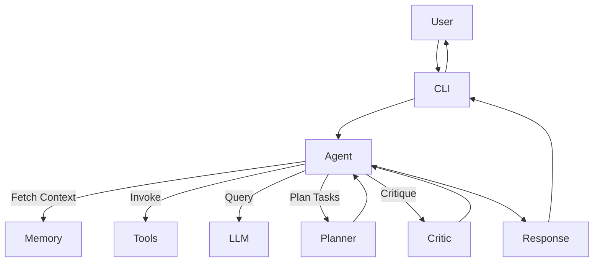

# 🧠 Agent Sandbox

**An Advanced Python Framework for Mastering Agentic AI—From Theory to Real-world Applications.**

---

## 🌟 Project Overview

`Agent Sandbox` is designed as an educational yet robust framework allowing Python developers to learn and implement sophisticated Agentic AI systems. Using LangChain, OpenAI, and comprehensive tooling, this sandbox covers critical agent workflows, including **reasoning, planning, tool integration, and reflection**, enabling hands-on mastery of autonomous AI systems.

---

## 📖 Core Concepts of Agentic AI

Agentic AI systems autonomously:

- **Observe** environments or user inputs.
- **Reason and plan** with memory/context.
- **Act** using tools and APIs.
- **Reflect** and refine outcomes.

---

## 📂 Project Structure

```
agent_sandbox/
├── agents/
│   ├── simple_agent.py
│   ├── react_agent.py
│   ├── reflection_agent.py
│   └── multi_agent.py
├── tools/
│   ├── calculator_tool.py
│   ├── search_tool.py
│   └── code_executor.py
├── memory/
│   └── memory_manager.py
├── prompts/
│   └── base_prompts.py
├── data/
├── ui/
│   └── app.py
├── tests/
│   └── test_queries.py
├── utils/
│   └── logging_utils.py
├── main.py
├── requirements.txt
└── README.md
```

---

## 🛠️ System Architecture



---

## ⚙️ Setup Instructions

### 📌 Clone Repository
```bash
git clone https://github.com/yourusername/agent_sandbox.git
cd agent_sandbox
```

### 📌 Environment Setup
```bash
python -m venv .venv
source .venv/bin/activate  # or .venv\Scripts\activate on Windows
pip install -r requirements.txt
```

### 📌 API Configuration
```bash
echo "OPENAI_API_KEY=your_key" > .env
```

### 📌 Running the CLI
```bash
python main.py --agent react
```
Agents available: `simple`, `react`, `reflection`, `multi`.

---

## 🔍 Distinct Agentic Capabilities

| Capability                | Description                                      |
|---------------------------|--------------------------------------------------|
| **Tool Integration**      | Execute calculations, code, and real-time searches|
| **Memory Management**     | Conversation history and context management      |
| **ReAct Framework**       | Integrated reasoning and action framework        |
| **Reflection Logic**      | Error assessment and iterative improvements      |
| **Multi-Agent Systems**   | Complex workflows through task delegation        |

---

## 🧪 Demonstrative Scenarios

These tasks require sophisticated agent interaction:

- **Complex Age Calculation** *(ReAct Agent)*:
  > "Calculate the age of a person born on July 4, 1980, using today's date."

- **Real-time Information** *(Search Tool)*:
  > "Identify the current CEO of Tesla and summarize their latest public statement."

- **Programming Task** *(Code Executor)*:
  > "Write and execute Python code to find primes between 50-100."

- **Memory Utilization** *(Memory Manager)*:
  > "Re-run the prime numbers function for range 100-150."

- **Iterative Reflection** *(Reflection Agent)*:
  > "Explain photosynthesis clearly, reflect on your answer, and refine it."

Responses explicitly indicate source agents:
```bash
[Agent: React Agent] Response: "The age calculated is 43 years."
```

---

## 🚧 Agent Guardrails

Agents gracefully handle out-of-scope queries:

**Example:**
> User: *"Generate a digital painting."*  
> Agent: *"I'm optimized for computational and informational tasks. Please use specialized generative AI tools for artistic tasks."*

---

## 📚 Structured Learning Path

1. **Simple Agent**: Direct LLM interactions.
2. **Tool Integration**: Empower agents with external capabilities.
3. **Memory Implementation**: Manage conversational history.
4. **ReAct Agent**: Advanced reasoning and decision-making.
5. **Reflection Agent**: Iterate and refine responses.
6. **Multi-Agent Coordination**: Handle complex tasks via multiple specialized agents.

---

## 🚀 Future Extensions

- **Long-term Memory**: Implement vector DB like Chroma/FAISS.
- **Graph-based Workflows**: Leverage LangGraph.
- **Interactive Frontend**: Build dashboards with Streamlit.
- **Automated Testing & Evaluation**: Performance metrics.
- **Multi-modal Capabilities**: Handle visual, auditory, and document inputs.

---

## 📝 Contributing

Contributions welcomed:
- 📑 Improve documentation and examples.
- ✅ Add testing and validation scenarios.
- 🛠 Propose enhancements or new tools.
- 📊 Develop interactive visualizations.

---

## 🎯 Objectives

Develop comprehensive skills in:
- Understanding agent architectures.
- Implementing real-world AI integrations.
- Building robust, intelligent systems.
- Troubleshooting and refining agent behaviors.

---

## 📬 Feedback & Collaboration

Share feedback or proposals via:
- [GitHub Issues](https://github.com/yourusername/agent_sandbox/issues)
- [LinkedIn](https://www.linkedin.com/in/your-profile/)

---

**Happy Agentic AI Mastery! 🚀🧠**
